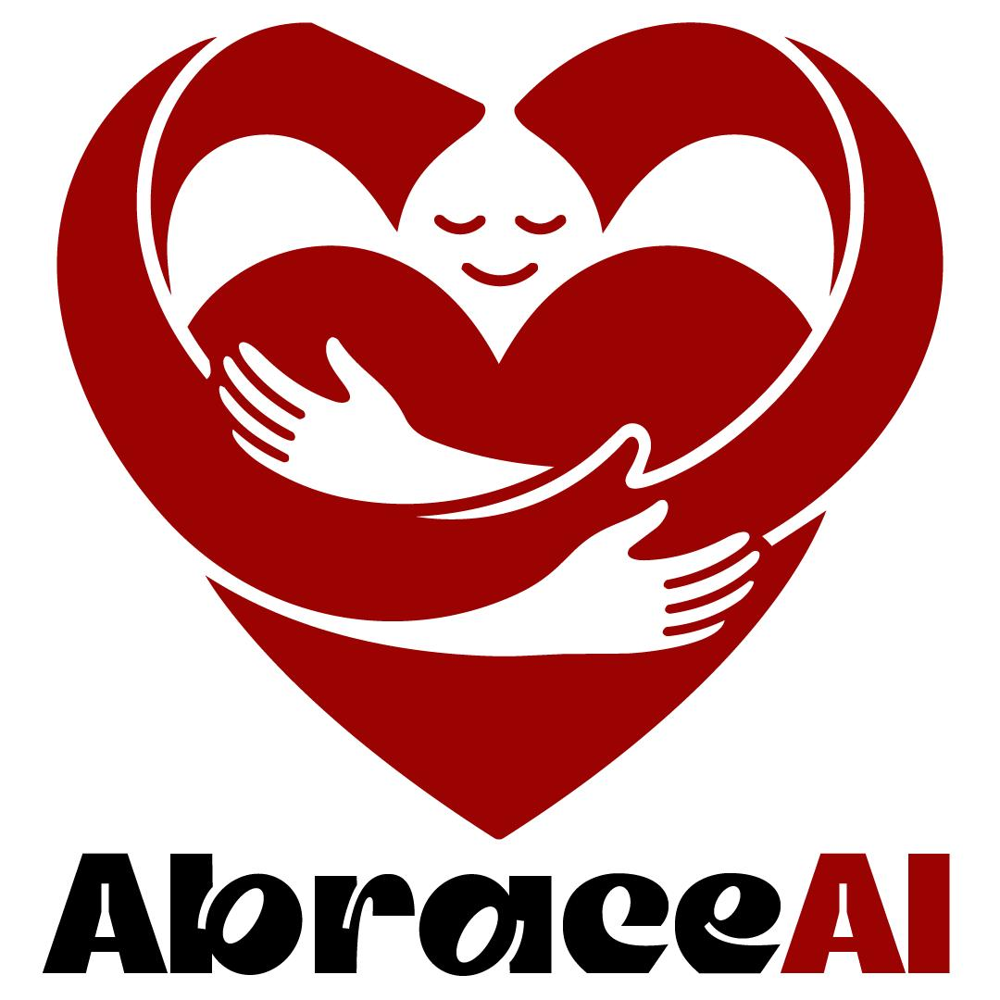

# Projeto 01 - 🫂 AbraceAI
---

## 🏫 FECAP - Fundação de Comércio Álvares Penteado

<p align="center">
<a href= "https://www.fecap.br/"></a>
</p>

---

## 👨‍💻 Integrantes: [André dos Santos](https://www.linkedin.com/in/andr%C3%A9-dos-santos-greg%C3%B3rio-025a402ba/), [Guilherme Fogolin](https://www.linkedin.com/in/guilhermefogolin/), [Pedro Lemos](https://www.linkedin.com/in/pedrohnlemos/) e [Yan Cezareto](https://www.linkedin.com/in/yan-cezareto-792ba22b8/)

---

## 👨‍🏫 Professores Orientadores: [Rodrigo da Rosa](https://www.linkedin.com/in/rodrigo-da-rosa-phd/), [Rafael Diogo Rossetti](https://www.linkedin.com/in/rafael-diogo-rossetti/), [Victor Rosetti](https://www.linkedin.com/in/victorbarq/), [Rodnil da Silva Moreira Lisboa](https://www.linkedin.com/in/professorrodnil/) e [Marcos Minoru Nakatsugawa](https://www.linkedin.com/in/marcosminorunakatsugawa/)
---

## 📄 Descrição

<p align="center">
  
</p>

Tendo como parceiro o **Lideranças Empáticas (LE)**, uma iniciativa que une impacto social e educação empreendedora na qual são desenvolvidas ações práticas de liderança, gestão e organização durante a arrecadação de alimentos, surgiu o **AbraceAI**. Visando aprimorar esse processo, estamos criando uma solução capaz de identificar, classificar e contar automaticamente os alimentos arrecadados, registrando de forma confiável os resultados por equipe e por categoria.

O projeto aplica **visão computacional** com o modelo YOLO11s para detectar embalagens de alimentos em tempo real a partir de uma câmera, eliminando a necessidade de contagem manual e reduzindo erros operacionais nas campanhas de arrecadação. Atualmente, o sistema reconhece cinco categorias de alimentos (arroz, feijão, açúcar, café e macarrão) e estima automaticamente o peso total e a quantidade dos itens.

---

## 📋 Detalhes

💻 **Aplicação web com cadastro de grupos e alimentos:** Foi desenvolvida uma plataforma web na qual é possível cadastrar os integrantes de cada grupo participante da campanha de arrecadação. Cada grupo registra manualmente os alimentos que coletou (quantidade e categoria) diretamente pelo sistema, sem depender de planilhas ou anotações físicas.

👀 **Validação por visão computacional:** Após o registro manual, o sistema utiliza o modelo YOLO11s para validar na prática o que foi informado: a câmera analisa os alimentos físicos presentes e compara o resultado da detecção automática com o que o grupo declarou, calculando a precisão do que foi informado. Isso cria uma camada de conferência objetiva e reduz inconsistências no registro das arrecadações.

📊 **BI e dashboards de acompanhamento:** O sistema conta com uma área de Business Intelligence com dashboards que consolidam os resultados das campanhas, exibindo os principais indicadores: resumo geral dos alimentos arrecadados, qual categoria foi mais coletada, e um ranking dos grupos por volume de arrecadação. Isso permite ao LE acompanhar o desempenho das equipes em tempo real e embasar decisões com dados.

💸 **Infraestrutura acessível e alinhada ao contexto social:** Todo o pipeline de visão computacional foi projetado para rodar com webcams comuns, ou seja, câmeras integradas de notebooks ou câmeras USB de baixo custo, sem necessidade de hardware especializado ou equipamentos caros. Essa decisão é intencional e diretamente alinhada à realidade do Lideranças Empáticas: uma iniciativa social que precisa de soluções funcionais, baratas e replicáveis. Na câmera integrada de um notebook convencional, o sistema opera a ~5 FPS, suficiente para triagem e validação durante as campanhas.

🏋️‍♂️ **Treinamento:** O modelo YOLO11s foi treinado por 60 épocas com batch size 16 e resolução 640×640, sobre um dataset de 454 instâncias anotadas distribuídas entre as 5 classes. 

---

## 🗂️ Estrutura de pastas

```
├── 🗂️ Documentos/
│   ├── 📁 Entrega01
│   │  └── 📂 Algebra_Linear
│   │  └── 📂 Inteligência_Artifical
│   │  └── 📂 Projeto_Interdisciplinar
│   │  └── 📂 Psicologia_Liderança_SoftSkills
│   │  └── 📂 Sistemas_Operacionais
│   ├── 📁 Entrega02
│   │  └── 📂 Algebra_Linear
│   │  └── 📂 Inteligência_Artifical
│   │  └── 📂 Projeto_Interdisciplinar
│   │  └── 📂 Psicologia_Liderança_SoftSkills
│   │  └── 📂 Sistemas_Operacionais
├── 🗂️ Imagens/
├── 🗂️ src/
│   ├── 📁 Entrega02
│   │  └── 📂 backend
│   │  └── 📂 frontend
└── 📄 readme.md
```

README.MD: Arquivo que serve como guia e explicação geral sobre o projeto.

Além disso, há outras pastas com os devidos arquivos em cada período de entrega:

⛲ [src](./src): Pasta que contém arquivos do frontend e backend do AbraceAI, divididos por entregas conforme cronograma da FECAP.

📄 [Documentos](/Documentos): Devidos documentos do projeto e arquivos relacionados as matérias de Algebra Linear, Inteligência Artificial, Projeto Interdisciplinar, Psicologia e Sistemas Operacionais.

📸 [Imagens](/Imagens): Reunião de imagens utilizadas no projeto.

---

## 💻 Versão final

Para acessar a versão final da AbraceAI hospedada na Azure, siga o link: [AbraceAI - Site oficial](https://abraceai-demo.proudwater-7c6d3801.brazilsouth.azurecontainerapps.io).

---

## 🛠️ Tutorial de instalação local

Acesse o tutorial de instalação local no link: [Como rodar localmente?](/Documentos/Tutorial_Instalacao_Local.md)

--- 

## ⚙️ Ferramentas e tecnologias

### Desenvolvimento principal
	


### Machine Learning


### Visualização de dados


### Prototipação e estilização


### Oganização

	


### Versionamento


---

## 📋 Licença

**AbraceAI** © 2026 by André Gregório dos Santos, Guilherme Reis Fogolin de Godoy, Pedro Henrique Nascimento Lemos, Yan Cezareto Ramos is licensed under CC BY-NC-ND 4.0

---

## 🎓 Referências 

1. ROKHVA, Shayan; TEIMOURPOUR, Babak; SOLTANI, Amir Hossein. **Computer vision in the food industry: accurate, real-time, and automatic food recognition with pretrained MobileNetV2**. arXiv, 2024. arXiv:2405.11621. Disponível em: https://arxiv.org/abs/2405.11621. Acesso em: 16 fev. 2026.

2. YANG, Yuanyuan; AN, Ruopeng; FANG, Cao; FERRIS, Dan. **Artificial intelligence in food bank and pantry services: a systematic review**. Nutrients, v. 17, n. 9, p. 1461, 26 abr. 2025. DOI: 10.3390/nu17091461. Disponível em: https://www.mdpi.com/2072-6643/17/9/1461. Acesso em: 21 fev. 2026.

3. CARRILLO-ZAPATA, Daniel et al. **Mutual shaping in swarm robotics: user studies in fire and rescue, storage organization, and bridge inspection**. Frontiers in Robotics and AI, v. 7, p. 53, 21 abr. 2020. DOI: 10.3389/frobt.2020.00053. Disponível em: https://www.frontiersin.org/journals/robotics-and-ai/articles/10.3389/frobt.2020.00053/full. Acesso em: 03 mar. 2026.
